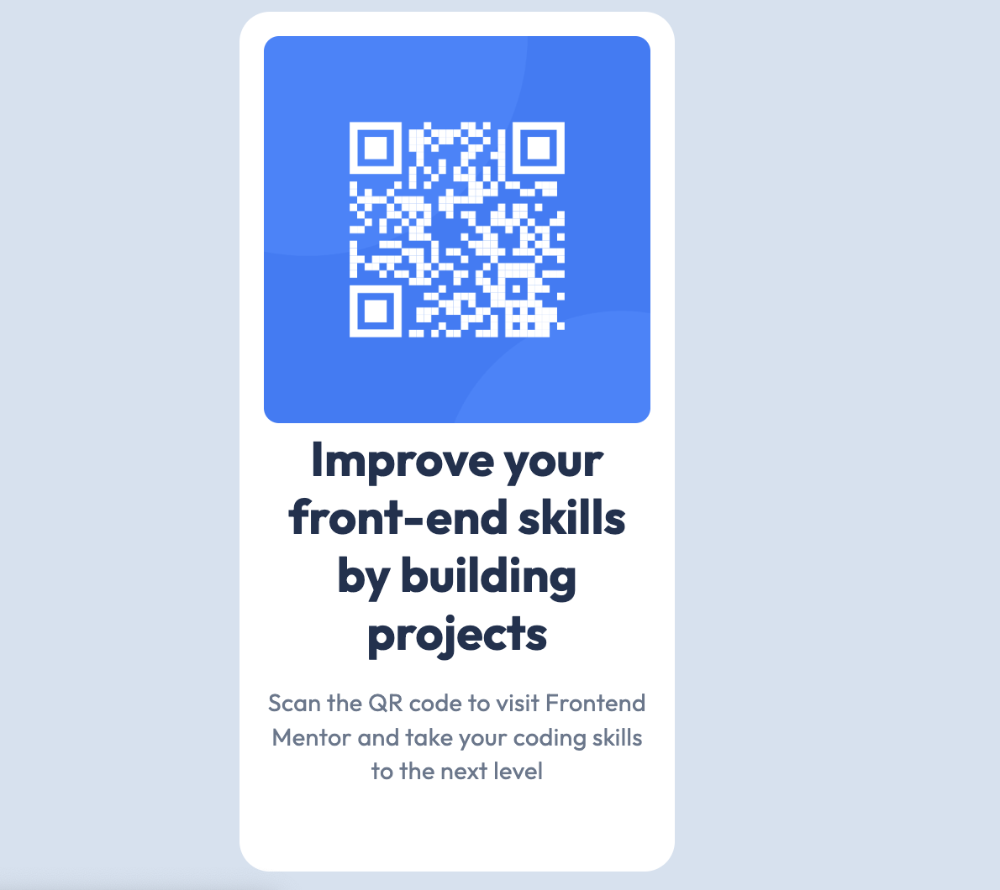

# Frontend Mentor - QR code component solution

This is a solution to the [QR code component challenge on Frontend Mentor](https://www.frontendmentor.io/challenges/qr-code-component-iux_sIO_H). Frontend Mentor challenges help you improve your coding skills by building realistic projects. 

## Table of contents

- [Overview](#overview)
  - [Screenshot](#screenshot)
  - [Links](#links)
- [My process](#my-process)
  - [Built with](#built-with)
  - [What I learned](#what-i-learned)
  - [Continued development](#continued-development)
  - [Useful resources](#useful-resources)
- [Author](#author)
- [Acknowledgments](#acknowledgments)

## Overview
A way to practice HTML and CSS skills for beginners. It is basic and does not delve into responsive design yet. 

### Screenshot

### Links

- Solution URL: [https://github.com/cfofana/qr-code-component-main](https://github.com/cfofana/qr-code-component-main)
- Live Site URL: [https://cfofana.github.io/qr-code-component-main/](https://cfofana.github.io/qr-code-component-main/)

### Built with

- Semantic HTML5 markup
- CSS custom properties
- Flexbox
- Mobile-first workflow

### What I learned

Reinforcing and remembering concepts learned like setting the radius of an image and letter spacing.Also using a figma design to get properties and exact measurements.

## Author

- Website - [Ceesay Fofana](https://www.ceesayfofana.com)
- Frontend Mentor - [@cfofana](https://www.frontendmentor.io/profile/cfofana)
- LinkedIn - [@ceesay](www.linkedin.com/in/ceesay)

